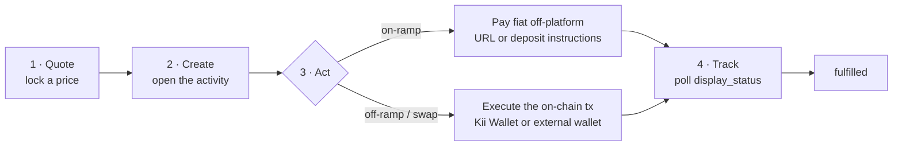

# Guides

KiiChain Pay gives you four ways to move value, split into **two families**:

- **Account-based activities** — **on-ramp**, **off-ramp**, and **FX swap**. Each is recorded as an **activity** (internally a _ticket_), runs through a state machine, is KYC-gated, and is tracked to a terminal status. These are the custodial, reconciled flows.
- **Permissionless DEX swap** — an on-chain token swap routed through a DEX from any wallet. It creates **no activity**, needs **no KYC**, and settles entirely on-chain.


New to KiiChain Pay? Start with the [Introduction](../introduction/README.md) to set up an account, complete [KYC](../introduction/kyc.md), provision your [Kii Wallet](../introduction/internal-wallets.md), [delegate it](../introduction/privy-delegated-access.md), and [create an API key](../introduction/generating-api-keys.md). This page assumes you have those in place.


## The common loop

Every account-based activity follows the same four beats. Only **step 3 (Act)** differs between them.



1. **Quote** — ask for a signed price for the amount you want to move. The quote is an envelope (`quote_payload` + `signature`) you pass back **verbatim** when you create the activity.
2. **Create** — open the activity. Off-ramp and swap return the on-chain **transactions** you must execute; on-ramp returns **fiat payment instructions**.
3. **Act** — this is where the flows diverge (see the table). On-ramp: pay fiat. Off-ramp/swap: execute the returned transaction.
4. **Track** — poll the activity and watch `display_status` until it reaches a terminal value: `fulfilled`, `canceled`, `failed`, `refunded`, or `expired`. (Non-terminal: `pending`, `processing`.)

**DEX swap** does not follow this loop — it has no activity to create or track. See [Creating a DEX swap](quick-start/creating-a-dex-swap.md).

## How the four compare

|                         | On-ramp                                                        | Off-ramp                              | FX swap                            | DEX swap                                  |
| ----------------------- | -------------------------------------------------------------- | ------------------------------------- | ---------------------------------- | ----------------------------------------- |
| **Direction**           | Fiat → Crypto                                                  | Crypto → Fiat                         | Crypto → Crypto                    | Crypto → Crypto (cross-chain)             |
| **Quote**               | `GET …/products-providers/{id}/quote`                          | `GET …/products-providers/{id}/quote` | `GET …/instruments/{id}/quote`     | `POST /market/v1/dex/quote`               |
| **Create**              | `POST …/products-providers/{id}/onramp` <br/>_(market module)_ | `POST /tickets/v1/offramp`            | `POST /tickets/v1/swap`            | — _(no activity)_                         |
| **How the user acts**   | Pay fiat off-platform                                          | Execute on-chain tx                   | Execute on-chain tx                | Sign & broadcast the returned tx yourself |
| **On-chain signing**    | None                                                           | `execute` (delegated) or self-sign    | `execute` (delegated) or self-sign | Self-sign (external wallet)               |
| **Destination needed**  | `destination_id` (receives crypto)                             | `withdraw_destination_id` (bank)      | Optional `withdraw_destination_id` (defaults to executing wallet) | None                                      |
| **Tracking**            | Poll `display_status`                                          | Poll `display_status`                 | Poll `display_status`              | On-chain only (watch the tx hash)         |
| **KYC / activity**      | KYC-gated · creates activity                                   | KYC-gated · creates activity          | KYC-gated · creates activity       | No KYC · no activity                      |
| **Provider settlement** | Always                                                         | Always                                | Sometimes (auto-fulfill or OTC)    | On-chain DEX (routed via LiFi)            |

## Discovering rails and IDs

Each create call needs IDs — a `products_provider_id` or `instrument_id`, your `account_id`, and sometimes a destination. Here is where they come from. All base URLs are `https://backend.pay.kiichain.io` (production).

### Your user and account IDs

`GET /users/v1/users/me` returns both in one call — `user.id` is your **`userId`** and `account.id` is your active **`accountId`**.

```bash
curl https://backend.pay.kiichain.io/users/v1/users/me \
  -H "Authorization: APIKey $KII_API_KEY"
```

An account can have more than one; `GET /accounts/v1/users/{userId}/accounts` lists them all as full `Account` objects (each with an `id`).

### On-ramp & off-ramp rails — products-providers

A **products-provider** pairs a product (a crypto token, or a fiat asset) with a provider, in one direction. Its `id` is the `products_provider_id` you use for the quote and the create call.

```bash
curl "https://backend.pay.kiichain.io/market/v1/products-providers?account_id=$KII_ACCOUNT_ID" \
  -H "Authorization: APIKey $KII_API_KEY"
```

Each entry in `products_providers[]` carries:

<table><thead><tr><th width="220">Field</th><th>Meaning</th></tr></thead><tbody>
<tr><td><code>id</code></td><td>The <code>products_provider_id</code> for quotes and creation.</td></tr>
<tr><td><code>type</code></td><td><strong>Direction</strong> — <code>"onramp"</code> or <code>"offramp"</code>. This is how you tell them apart.</td></tr>
<tr><td><code>product</code></td><td>The crypto leg. <code>product.chain_token</code> gives the token (<code>token.symbol</code>, <code>token.decimals</code>, <code>contract_address</code>) and chain (<code>chain.chain_id</code>); <code>product.type</code> is <code>"crypto"</code> or <code>"fiat"</code>.</td></tr>
<tr><td><code>fiat_asset</code></td><td>The fiat leg — <code>{ code, name, symbol }</code> (ISO 4217).</td></tr>
<tr><td><code>provider</code></td><td>The provider — <code>provider.name</code>, etc.</td></tr>
<tr><td><code>enabled</code></td><td>Whether the rail is currently available.</td></tr>
</tbody></table>

Min/max amounts live on a separate call: `GET /market/v1/products-providers/{id}/limits` returns `limits` with `min_fiat_amount`, `max_fiat_amount`, `min_token_amount`, `max_token_amount`.

### FX swap pairs — instruments

An **instrument** is a swap pair (base → quote). Its `id` is the `instrument_id`.

```bash
curl "https://backend.pay.kiichain.io/market/v1/instruments?account_id=$KII_ACCOUNT_ID" \
  -H "Authorization: APIKey $KII_API_KEY"
```

Each entry in `instruments[]` has `id`, `name`, `description`, `product_base` (input) and `product_quote` (output) — each a full `Product` with its `chain_token`/`fiat_asset` — plus `provider`, `spread`, and `enabled`. Limits come from `GET /market/v1/instruments/{id}/limits?side=buy|sell` (`min_base_amount`, `max_base_amount`, `min_quote_amount`, `max_quote_amount`).

### Fiat assets

`GET /market/v1/fiat-assets` lists supported fiat currencies (`fiat_assets[]` of `{ code, name, symbol }`); `GET /market/v1/fiat-assets/{code}` fetches one by its 3-letter code.

### Withdrawal destinations

Off-ramp needs a **bank** destination (`withdraw_destination_id`); on-ramp needs a **wallet** destination that receives the crypto (`destination_id`). Both come from the same list:

```bash
curl "https://backend.pay.kiichain.io/accounts/v1/users/$KII_USER_ID/accounts/$KII_ACCOUNT_ID/withdrawal_destinations" \
  -H "Authorization: APIKey $KII_API_KEY"
```

Each entry in `destinations[]` has `id`, `type` (`"bank"` or `"wallet"`), `name` (your label), `rail_code` / `rail_version`, `country`, `status` (confirmed or not), `identifier`, and a rail-specific `payload`.

To **create** one, first read the rail schema so you know which fields the `payload` needs, then register and confirm it:

1. `GET /accounts/v1/rails/schemas?country={country}` → `schemas[]` of `{ rail_code, rail_version, country, type, schema }`, where `schema.fields[]` describes each required field (`name`, `type`, `optional`, `pattern`, `options`).
2. `POST /accounts/v1/users/{userId}/accounts/{accountId}/withdrawal_destinations` with `{ rail_code, rail_version, payload, name }`.
3. `POST /accounts/v1/users/{userId}/accounts/{accountId}/withdrawal_destinations/{destinationId}:confirm` with the `{ verify_code }` sent to you after registration.

### DEX-enabled tokens

DEX token discovery is **public** (no API key). Filter with `mode=dex` to get only DEX-enabled tokens:

```bash
curl "https://backend.pay.kiichain.io/blockchain/v1/chains/tokens/all?mode=dex"
```

`chains_tokens[]` are `ChainToken` objects: `token` (`symbol`, `decimals`, `name`, `logo`), `chain` (`chain_id`, `type`, `name`), `native`, `contract_address` (absent for native tokens), and `enabled_dex`.

## The guides

- [Creating an on-ramp](quick-start/creating-an-on-ramp.md) — fiat → crypto.
- [Creating an off-ramp](quick-start/creating-an-off-ramp.md) — crypto → fiat.
- [Creating an FX swap](quick-start/creating-an-fx-swap.md) — crypto → crypto, custodial.
- [Creating a DEX swap](quick-start/creating-a-dex-swap.md) — crypto → crypto, permissionless.
