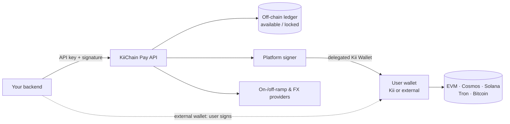
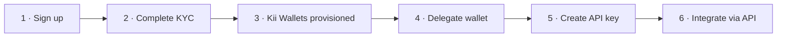

# Introduction

**KiiChain Pay** (formerly KiiEx) is the payments and foreign-exchange layer of the Kii ecosystem. It lets you move value between **fiat and crypto**, run **FX** and **DEX** swaps, and operate **on-ramps** and **off-ramps** — mixing on-chain and off-chain operations behind one programmatic interface.

The product is **non-custodial**: every KYC-verified account gets its own embedded **Kii Wallet** whose keys are held by our wallet provider and owned by the user, never by KiiChain Pay. To automate on-chain operations from a Kii Wallet, the user grants the platform an explicit **delegation** to sign on its behalf.


The KiiChain Pay web app lives at [https://pay.kiichain.io](https://pay.kiichain.io). This documentation is for **third parties automating KiiChain Pay** — integrating it into your own systems. You'll generate API keys, delegate your wallet, and drive FX, ramps and swaps from your own backend.


## Core concepts

<table><thead><tr><th width="220">Concept</th><th>What it means</th></tr></thead><tbody>
<tr><td><strong>Non-custodial by design</strong></td><td>Users transact from a non-custodial wallet — the embedded <strong>Kii Wallet</strong> (keys managed by Privy, owned by the user) or their <strong>own external wallet</strong>. KiiChain Pay never holds a private key.</td></tr>
<tr><td><strong>Internal wallets (Kii Wallet)</strong></td><td><strong>Optional.</strong> A convenience embedded wallet — one per account, per supported chain (EVM, Cosmos, Solana, Tron, Bitcoin), with sponsored gas and no key management. Users can bring their own external wallet instead; on-ramps, off-ramps and FX swaps work the same either way. Provisioned automatically once KYC is approved. See <a href="internal-wallets.md">Internal wallets</a>.</td></tr>
<tr><td><strong>Delegated access</strong></td><td>A user delegates their Kii Wallet to the platform's signer so you can sign and broadcast transactions server-side — no per-transaction signing prompt. See <a href="privy-delegated-access.md">Privy delegated access</a>.</td></tr>
<tr><td><strong>On-chain + off-chain</strong></td><td>Crypto balances live on-chain in the user's wallet (Kii or external); fiat and reserved balances are tracked in KiiChain Pay's internal double-entry ledger (<code>available</code> / <code>locked</code>).</td></tr>
<tr><td><strong>KYC-gated</strong></td><td>Kii Wallets, fiat rails, limits and provider access unlock through KYC. <strong>DEX swaps from an external wallet need no KYC.</strong> See <a href="kyc.md">KYC</a>.</td></tr>
<tr><td><strong>API keys</strong></td><td>Every authenticated API call carries an API key; write calls are additionally signed. See <a href="generating-api-keys.md">Generating API keys</a>.</td></tr>
<tr><td><strong>Permissionless DEX</strong></td><td>DEX swaps run on-chain directly from any external wallet — no account, KYC or authenticated user required, and no activity is recorded.</td></tr>
</tbody></table>

## How the pieces fit together

Crypto moves on-chain through the user's wallet — a **Kii Wallet** or their **own external wallet**; fiat moves through **provider rails** (on-ramps, off-ramps, virtual accounts); and KiiChain Pay keeps both sides reconciled in its **internal ledger**.

## The integration journey

Setup is **dashboard-first**: a few one-time steps in [pay.kiichain.io](https://pay.kiichain.io) unlock the API for everything that follows.

1. **Sign up** for a KiiChain Pay account at [pay.kiichain.io](https://pay.kiichain.io).
2. **Complete KYC** — choose individual or company. This sets your account level and limits. See [KYC](kyc.md).
3. **Kii Wallets are provisioned automatically** the moment KYC is approved — one per supported chain. See [Internal wallets](internal-wallets.md).
4. **Delegate your Kii Wallet** so the platform can sign wallet operations for you. See [Privy delegated access](privy-delegated-access.md).
5. **Create an API key** and store the secret. See [Generating API keys](generating-api-keys.md).
6. **Integrate** — build on-ramps, off-ramps and FX swaps via the API. See the [Guides](../guides/README.md) and [API Reference](../api-reference/README.md).


Using your **own external wallet**? You sign transactions yourself — skip delegation (step 4). (**DEX swaps** need none of this flow at all.)


## Environments

KiiChain Pay exposes two environments. Point your integration at the matching **API base URL**:

<table><thead><tr><th width="150">Environment</th><th>App</th><th>API base URL</th></tr></thead><tbody>
<tr><td><strong>Production</strong></td><td>https://pay.kiichain.io</td><td><code>https://backend.pay.kiichain.io</code></td></tr>
<tr><td><strong>Staging</strong></td><td>https://pay.staging.kiichain.io</td><td><code>https://backend.pay.staging.kiichain.io</code></td></tr>
</tbody></table>

All REST endpoints are versioned and namespaced by module — for example `/users/v1/...`, `/accounts/v1/...`, and `/market/v1/...`.


**Gas is on us.** Every Kii Wallet operation is gas-sponsored by KiiChain Pay, so you don't need to hold native tokens to transact. Lean into it.


## Next steps

- [Generating API keys](generating-api-keys.md) — create a key and sign requests.
- [Internal wallets](internal-wallets.md) — understand the Kii Wallet model.
- [Privy delegated access](privy-delegated-access.md) — enable server-side signing.
- [KYC](kyc.md) — levels, limits, and provider verification.
