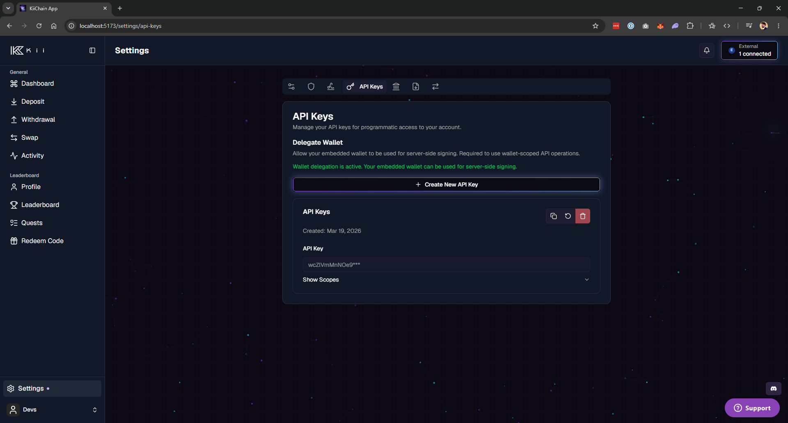
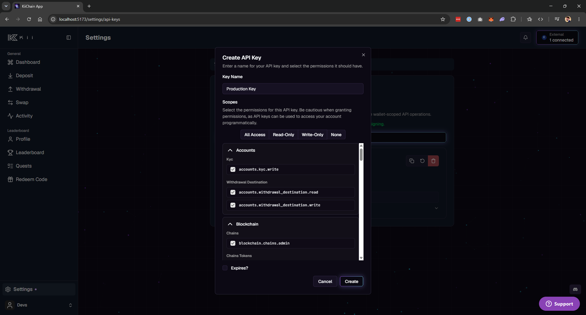
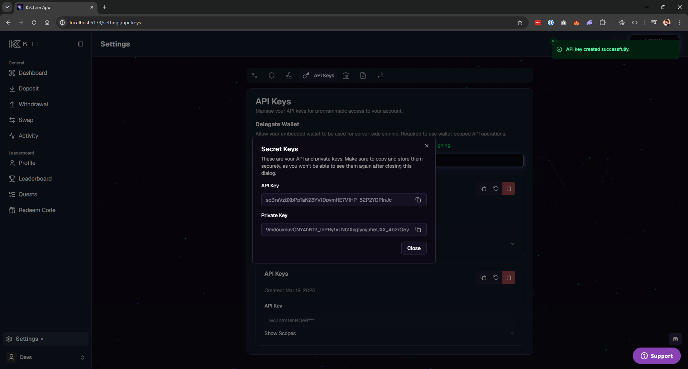
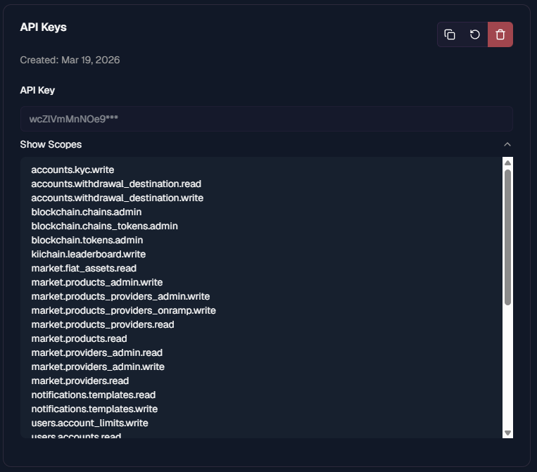

# Generating API keys

Every request to the KiiChain Pay API is authenticated with an **API key**. Write requests are additionally **signed** with the key's private key. You create and manage keys from the dashboard; you then use them from your backend.

## 1. Create a key in the dashboard

API keys are created and managed in the KiiChain Pay app. Sign in at [pay.kiichain.io](https://pay.kiichain.io) and go to **Settings → API Keys**.

<figure><figcaption><p>Settings → API Keys, with the <strong>Create New API Key</strong> button and any existing keys.</p></figcaption></figure>

Click **Create API Key** and fill in:

<table><thead><tr><th width="170">Field</th><th>Description</th></tr></thead><tbody>
<tr><td><strong>Name</strong></td><td>A label to identify the key (e.g. <code>Production backend</code>). Required.</td></tr>
<tr><td><strong>Scopes</strong></td><td>The permissions the key grants. At least one is required. A key can only be granted scopes you already have — see <a href="#scopes">Scopes</a>. Quick-select buttons let you pick <em>All access</em>, <em>Read only</em>, <em>Write only</em>, or <em>None</em>.</td></tr>
<tr><td><strong>Expires at</strong></td><td>Optional expiry date. If omitted, the key does not expire. We recommend setting one and rotating regularly.</td></tr>
</tbody></table>

<figure><figcaption><p>The <strong>Create API Key</strong> dialog: name, scope quick-select, and the grouped scope list.</p></figcaption></figure>

## 2. Store the secret — shown only once

When the key is created you'll see three values:

- **API key** (`api_key`) — the opaque token you send in the `Authorization` header.
- **Private key** (`priv_key`) — the Ed25519 private key used to sign write requests.
- **Public key** (`pub_key`) — stored by KiiChain Pay to verify your signatures; also visible later on the key's card.


The **API key** and **private key** are displayed **only once**, at creation. KiiChain Pay does not store the private key and cannot recover it. Copy both into a secure secret store before closing the dialog. If you lose them, rotate the key.


<figure><figcaption><p>The one-time reveal: copy the <strong>API Key</strong> and <strong>Private Key</strong> before closing — they're never shown again.</p></figcaption></figure>

After you close the dialog, the key appears in the list showing only a **masked prefix** (`abc123def456***`) and its public key. From the key's card you can **copy the public key**, **rotate**, or **delete** the key.

<figure><figcaption><p>An existing key: masked value, the expanded <strong>Scopes</strong> list, and the copy / rotate / delete actions.</p></figcaption></figure>

- **Rotate** issues a new API key and private key for the same key entry (the old credentials stop working immediately). The new secret is shown once, exactly like creation.
- **Delete** revokes the key immediately.

## 3. Authenticate your requests

Send your API key as an `Authorization` header with the **`APIKey`** scheme (not `Bearer`):

```
Authorization: APIKey <your_api_key>
```

**Read requests** (`GET`, `OPTIONS`) need only this header:

```bash
curl https://backend.pay.kiichain.io/accounts/v1/countries \
  -H "Authorization: APIKey $KII_API_KEY"
```

**Write requests** (`POST`, `PATCH`, `PUT`, `DELETE`) must additionally be **signed** — see below.

## 4. Sign write requests

Write requests carry two extra headers:

<table><thead><tr><th width="180">Header</th><th>Value</th></tr></thead><tbody>
<tr><td><code>x-timestamp</code></td><td>The current time, as a string. Unix seconds (<code>1739471625</code>) or milliseconds (<code>1739471625123</code>) both work — the server signs whatever string you send. Use the <strong>same value</strong> in the signed payload.</td></tr>
<tr><td><code>x-signature</code></td><td>Base64url (no padding) Ed25519 signature of the canonical payload below.</td></tr>
</tbody></table>

The signed **payload** is four lines joined by `\n`:

```
payload = timestamp + "\n" + method + "\n" + uri + "\n" + bodyHash
```

| Part        | Value                                                                                                                                                                                |
| ----------- | ------------------------------------------------------------------------------------------------------------------------------------------------------------------------------------ |
| `timestamp` | The exact string you put in the `x-timestamp` header (Unix seconds or milliseconds — just keep it identical in both places).                                                         |
| `method`    | The HTTP method, uppercase (`POST`, `PATCH`, `PUT`, `DELETE`).                                                                                                                       |
| `uri`       | The request URI **including path and query string** (e.g. `/users/v1/api/create`).                                                                                                   |
| `bodyHash`  | Lowercase **hex** SHA-256 of the raw request body bytes. For an empty body, use the SHA-256 of the empty string: `e3b0c44298fc1c149afbf4c8996fb92427ae41e4649b934ca495991b7852b855`. |

Sign the UTF-8 bytes of `payload` with your Ed25519 **private key** and send the base64url-encoded signature in `x-signature`.


Sign exactly the bytes you send. The signature covers the timestamp, method, URI (with query string) and a hash of the request body — any mismatch is rejected. Use a **fresh `x-timestamp` per request** to avoid replay rejection.


### Reference implementation

These helpers add the correct headers and sign write requests using only each language's **standard library** — no third-party dependencies.



Requires Node.js 18+ (for the global `fetch` and `base64url` encoding). The `priv_key` is the raw 64-byte Ed25519 key (`seed || publicKey`), which `node:crypto` imports via a JWK.

```typescript
import { createHash, createPrivateKey, sign } from "node:crypto";

const BASE_URL = "https://backend.pay.kiichain.io";
const API_KEY = process.env.KII_API_KEY!; // the opaque "api_key"
const PRIV_KEY = process.env.KII_PRIV_KEY!; // base64url "priv_key", shown once

const WRITE_METHODS = new Set(["POST", "PATCH", "PUT", "DELETE"]);

// The priv_key is the raw 64-byte Ed25519 key: seed (first 32) || public key (last 32).
const rawPrivKey = Buffer.from(PRIV_KEY, "base64url");
const signingKey = createPrivateKey({
  format: "jwk",
  key: {
    kty: "OKP",
    crv: "Ed25519",
    d: rawPrivKey.subarray(0, 32).toString("base64url"), // private seed
    x: rawPrivKey.subarray(32).toString("base64url"), // public key
  },
});

/**
 * `path` must include the query string, e.g. "/market/v1/quotes?type=onramp".
 */
export async function kiiFetch(method: string, path: string, body?: unknown) {
  method = method.toUpperCase();
  const rawBody = body === undefined ? "" : JSON.stringify(body);
  const timestamp = Date.now().toString();

  const headers: Record<string, string> = {
    Authorization: `APIKey ${API_KEY}`,
    "x-timestamp": timestamp,
  };

  if (WRITE_METHODS.has(method)) {
    const bodyHash = createHash("sha256").update(rawBody, "utf8").digest("hex");
    const payload = `${timestamp}\n${method}\n${path}\n${bodyHash}`;
    headers["x-signature"] = sign(
      null,
      Buffer.from(payload, "utf8"),
      signingKey,
    ).toString("base64url");
    headers["Content-Type"] = "application/json";
  }

  return fetch(BASE_URL + path, {
    method,
    headers,
    body: rawBody === "" ? undefined : rawBody,
  });
}
```





```go
package kiipay

import (
	"bytes"
	"crypto/ed25519"
	"crypto/sha256"
	"encoding/base64"
	"encoding/hex"
	"fmt"
	"net/http"
	"os"
	"strconv"
	"time"
)

const baseURL = "https://backend.pay.kiichain.io"

var writeMethods = map[string]bool{
	http.MethodPost: true, http.MethodPatch: true,
	http.MethodPut: true, http.MethodDelete: true,
}

// KiiRequest builds and sends a signed KiiChain Pay API request.
// path must include the query string, e.g. "/market/v1/quotes?type=onramp".
func KiiRequest(method, path string, body []byte) (*http.Response, error) {
	apiKey := os.Getenv("KII_API_KEY")   // the opaque "api_key"
	privKey := os.Getenv("KII_PRIV_KEY") // base64url "priv_key", shown once

	timestamp := strconv.FormatInt(time.Now().Unix(), 10) // seconds or millis both work

	req, err := http.NewRequest(method, baseURL+path, bytes.NewReader(body))
	if err != nil {
		return nil, err
	}
	req.Header.Set("Authorization", "APIKey "+apiKey)
	req.Header.Set("x-timestamp", timestamp)

	// Sign write requests (POST, PATCH, PUT, DELETE).
	if writeMethods[method] {
		sum := sha256.Sum256(body)
		bodyHash := hex.EncodeToString(sum[:])
		payload := fmt.Sprintf("%s\n%s\n%s\n%s", timestamp, method, path, bodyHash)

		// priv_key decodes to the raw 64-byte Ed25519 private key.
		priv, err := base64.RawURLEncoding.DecodeString(privKey)
		if err != nil {
			return nil, err
		}
		sig := ed25519.Sign(ed25519.PrivateKey(priv), []byte(payload))
		req.Header.Set("x-signature", base64.RawURLEncoding.EncodeToString(sig))
		req.Header.Set("Content-Type", "application/json")
	}

	return http.DefaultClient.Do(req)
}
```




### Signing in other languages

The scheme is language-agnostic — reproduce these steps with any Ed25519 and SHA-256 library:

1. `bodyHash = hex(sha256(rawBodyBytes))`
2. `payload = "{timestamp}\n{METHOD}\n{uri}\n{bodyHash}"`
3. `signature = base64url_nopad(ed25519_sign(privateKey, utf8(payload)))`
4. Send headers `Authorization: APIKey <api_key>`, `x-timestamp: <timestamp>`, `x-signature: <signature>`.

Base64url-decode `priv_key` to obtain the raw 64-byte Ed25519 private key.

## Scopes

Scopes follow the pattern `<module>.<resource>.<action>`, where the action is one of `read`, `write`, `update`, `delete`, or `admin`. A key's scopes are validated on every call, and the endpoint you hit declares which scope it requires.


A key can never have more access than the account that created it — requested scopes are capped by **your own** scopes. Scopes with an `:all` suffix (cross-account) and `admin` scopes are elevated permissions and are generally not available to integrator keys.


Commonly used scopes:

<table><thead><tr><th width="330">Scope</th><th>Grants</th></tr></thead><tbody>
<tr><td><code>users.api.read</code> / <code>write</code> / <code>update</code> / <code>delete</code></td><td>Manage your API keys.</td></tr>
<tr><td><code>users.accounts.read</code> / <code>write</code></td><td>Read and manage accounts.</td></tr>
<tr><td><code>accounts.kyc.read</code> / <code>write</code></td><td>Read KYC status / start KYC.</td></tr>
<tr><td><code>accounts.withdrawal_destination.read</code> / <code>write</code></td><td>Manage withdrawal destinations (bank accounts, wallet addresses).</td></tr>
<tr><td><code>market.products.read</code>, <code>market.providers.read</code>, <code>market.dex.read</code>, <code>market.instruments.read</code>, <code>market.fiat_assets.read</code></td><td>Discover on-/off-ramp products, providers, DEX routes, instruments and fiat assets.</td></tr>
<tr><td><code>market.providers_virtual_accounts.read</code> / <code>write</code></td><td>Create and read virtual accounts for fiat on-/off-ramps.</td></tr>
<tr><td><code>tickets.tickets.read</code> / <code>write</code></td><td>Create and track on-ramp, off-ramp and swap tickets.</td></tr>
<tr><td><code>ledger.entries.read</code></td><td>Read ledger balances and transaction history.</td></tr>
</tbody></table>

The dashboard's create dialog always lists the full, current set of scopes available to your account.

## Next steps

- [Internal wallets](internal-wallets.md) — the Kii Wallet model your API operations act on.
- [Privy delegated access](privy-delegated-access.md) — required before your key can drive wallet operations.
- [API Reference](../api-reference/README.md) — per-endpoint scopes and payloads.
