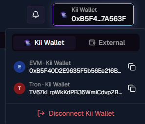
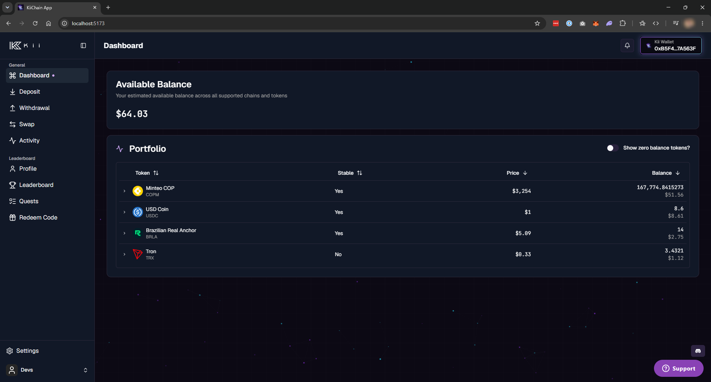

# Internal wallets

The **Kii Wallet** is a set of **embedded wallets** that KiiChain Pay can provision for an account. They are **non-custodial**: the private keys are managed by [Privy](https://privy.io) and owned by the user — KiiChain Pay never holds a private key.

Using a Kii Wallet is **optional**. A user can transact with their **own external wallet** instead, and on-ramps, off-ramps and FX swaps work exactly the same either way. The Kii Wallet is simply a convenience for users who'd rather not manage private keys and wallet tooling — and it comes with **sponsored gas**.

Alongside on-chain wallets, KiiChain Pay keeps an **internal ledger** that tracks fiat and reserved balances off-chain. Together they let you mix on-chain and off-chain operations seamlessly.

## What a Kii Wallet is

- An **embedded wallet** created and secured by Privy, one **per account, per supported chain**.
- **Supported chain types:** EVM (Ethereum-compatible, including KiiChain), Cosmos, Solana, Tron, and Bitcoin (SegWit).
- **Non-custodial:** keys live with Privy and belong to the user. To let your backend transact from a wallet, the user must first [delegate it](privy-delegated-access.md) to the platform signer.
- **Gas-sponsored:** every Kii Wallet operation is paid for by KiiChain Pay, so users never need native gas tokens.


Kii Wallets are provisioned **automatically when KYC is approved** — not at signup. An account at level 0 (no KYC) has no wallets yet. See [KYC](kyc.md).


## On-chain balances vs. the off-chain ledger

KiiChain Pay tracks value in two places:

<table><thead><tr><th width="200">Where</th><th>What it holds</th></tr></thead><tbody>
<tr><td><strong>On-chain (Kii Wallet)</strong></td><td>Crypto assets, held at the wallet's address on each chain. Balances are read directly from the blockchain.</td></tr>
<tr><td><strong>Off-chain (internal ledger)</strong></td><td>Fiat and reserved balances, tracked in a double-entry ledger. Each balance has an <code>available</code> portion and a <code>locked</code> portion (funds reserved for an in-flight withdrawal, swap or ramp).</td></tr>
</tbody></table>

This split is why a swap or off-ramp can reserve funds (`locked`) the instant you create it, while the on-chain settlement happens moments later.

## How funds move

Every flow works with **either** a Kii Wallet or a user's own external wallet:

- **Deposits** — receive crypto to the wallet address, or fund a fiat **virtual account** via an on-ramp provider.
- **Withdrawals** — send crypto to an external address, or off-ramp to a bank account through a provider.
- **On-ramps, off-ramps & FX swaps** — bridge fiat and crypto, or swap between assets. The crypto leg settles on-chain through KiiChain Pay's settlement contracts, while the fiat leg moves over provider rails and is reconciled in the internal ledger. Each is tracked as an **activity** (internally, a _ticket_). With a delegated Kii Wallet the platform signs on the user's behalf; with an external wallet the user signs.
- **DEX swaps** — swap tokens directly on-chain through the DEX. **No authenticated user and no KYC are required**: a user can run a DEX swap anonymously from any external wallet, and it creates **no activity**. Sponsored gas applies only to Kii Wallets.

See the [Guides](../guides/README.md) for end-to-end [on-ramp](../guides/quick-start/creating-an-on-ramp.md), [off-ramp](../guides/quick-start/creating-an-off-ramp.md), and [FX swap](../guides/quick-start/creating-an-fx-swap.md) walkthroughs.

## Viewing your wallets

In the app, the wallet switcher (top-right) lists the Kii Wallet's address on each supported chain, and the dashboard shows balances across all of them.

<figure><figcaption><p>The wallet switcher: per-chain Kii Wallet addresses (EVM, Tron, …), with an external wallet as the alternative.</p></figcaption></figure>

<figure><figcaption><p>The dashboard's available balance and per-token portfolio for the connected wallet.</p></figcaption></figure>

## Accessing wallets via the API

Three endpoints expose Kii Wallets to your backend. All authenticate with an [API key](generating-api-keys.md); the examples assume `KII_API_KEY` holds your key.

### List your Kii Wallets

`GET /blockchain/v1/wallets/internal` returns the caller's Kii Wallets across **every supported chain type**, one entry per chain. This is a read request, so it needs only the `Authorization` header. Requires the `blockchain.wallets.read` scope.

```bash
curl https://backend.pay.kiichain.io/blockchain/v1/wallets/internal \
  -H "Authorization: APIKey $KII_API_KEY"
```

```json
{
  "wallets": [
    {
      "id": "b1c3f0a2-7e4d-4c8a-9f21-0a5b6c7d8e9f",
      "address": "0x1A2b3C4d5E6f7A8b9C0d1E2f3A4b5C6d7E8f9A0b",
      "chainType": "ethereum"
    },
    {
      "id": "d4e5f6a7-8b9c-4d0e-a1f2-3b4c5d6e7f80",
      "address": "TQn9Y2khEsLJW1ChVWFMSMeRDow5KcbfSL",
      "chainType": "tron"
    }
  ]
}
```

### Send tokens from a Kii Wallet

`POST /blockchain/v1/wallets/internal/send` builds a transfer from the caller's Kii Wallet to another address, then signs and broadcasts it using the [delegated](privy-delegated-access.md) wallet — so the wallet **must be delegated** first. It works on any supported chain given its `chain_id`. Requires the `blockchain.wallets.send` scope.

This is a **write request**, so it must also carry the `x-timestamp` and `x-signature` headers described in [Sign write requests](generating-api-keys.md#4.-sign-write-requests). The examples below show the request shape — compute the signature over the exact body you send.

Request body:

<table><thead><tr><th width="150">Field</th><th>Description</th></tr></thead><tbody>
<tr><td><code>chain_id</code></td><td>Numeric network ID, as a string (e.g. <code>"1"</code> for Ethereum mainnet). Required.</td></tr>
<tr><td><code>to</code></td><td>Destination address that receives the balance. Required.</td></tr>
<tr><td><code>asset</code></td><td>Token contract address to send. Omit (or use the zero address) to send the <strong>native gas token</strong>. Optional.</td></tr>
<tr><td><code>amount</code></td><td>Amount in the token's <strong>smallest unit</strong> (wei / atoms), as a string. Required.</td></tr>
</tbody></table>

**Send the native gas token** (omit `asset`) — here, 0.01 ETH (`10000000000000000` wei):

```bash
curl -X POST https://backend.pay.kiichain.io/blockchain/v1/wallets/internal/send \
  -H "Authorization: APIKey $KII_API_KEY" \
  -H "x-timestamp: $KII_TIMESTAMP" \
  -H "x-signature: $KII_SIGNATURE" \
  -H "Content-Type: application/json" \
  -d '{
    "chain_id": "1",
    "to": "0x1A2b3C4d5E6f7A8b9C0d1E2f3A4b5C6d7E8f9A0b",
    "amount": "10000000000000000"
  }'
```

**Send an ERC-20 token** (set `asset` to the token contract) — here, 25 USDC (6 decimals → `25000000`):

```bash
curl -X POST https://backend.pay.kiichain.io/blockchain/v1/wallets/internal/send \
  -H "Authorization: APIKey $KII_API_KEY" \
  -H "x-timestamp: $KII_TIMESTAMP" \
  -H "x-signature: $KII_SIGNATURE" \
  -H "Content-Type: application/json" \
  -d '{
    "chain_id": "1",
    "to": "0x1A2b3C4d5E6f7A8b9C0d1E2f3A4b5C6d7E8f9A0b",
    "asset": "0xA0b86991c6218b36c1d19D4a2e9Eb0cE3606eB48",
    "amount": "25000000"
  }'
```

Both return the broadcast transaction hash:

```json
{
  "txHash": "0x9f8e7d6c5b4a39281706f5e4d3c2b1a09f8e7d6c5b4a39281706f5e4d3c2b1a0"
}
```

### Execute prepared transactions

`POST /blockchain/v1/transactions/execute` signs and broadcasts a **batch of prepared transactions** from the caller's Kii Wallet — again using the [delegated](privy-delegated-access.md) wallet, with gas sponsored. Unlike `send`, you don't describe a transfer; you hand it transactions that were **built for you elsewhere** and just need signing. The two common sources are:

- The `transactions` returned when you create an [off-ramp](../guides/quick-start/creating-an-off-ramp.md) or [FX swap](../guides/quick-start/creating-an-fx-swap.md) activity.
- A [DEX swap](../guides/quick-start/creating-a-dex-swap.md) quote's `evm_tx`, decoded into its fields.

The wallet **must be delegated**, and this requires the `blockchain.transactions.execute` scope. It is a **write request**, so it also carries the `x-timestamp` and `x-signature` headers from [Sign write requests](generating-api-keys.md#4.-sign-write-requests).

Request body — a `transactions` array. Each entry wraps a chain-specific transaction; for EVM chains that's an `evm` object:

<table><thead><tr><th width="150">Field</th><th>Description</th></tr></thead><tbody>
<tr><td><code>chain_id</code></td><td>Numeric network ID, as a string. Required.</td></tr>
<tr><td><code>to</code></td><td>Destination — usually a contract address. Required.</td></tr>
<tr><td><code>value</code></td><td>Native token amount in wei, as a string (<code>"0"</code> for pure contract calls). Required.</td></tr>
<tr><td><code>data</code></td><td>Hex-encoded call data (<code>0x…</code>). Required for contract calls.</td></tr>
<tr><td><code>from</code></td><td>The Kii Wallet address the transaction is signed from.</td></tr>
</tbody></table>

```bash
curl -X POST https://backend.pay.kiichain.io/blockchain/v1/transactions/execute \
  -H "Authorization: APIKey $KII_API_KEY" \
  -H "x-timestamp: $KII_TIMESTAMP" \
  -H "x-signature: $KII_SIGNATURE" \
  -H "Content-Type: application/json" \
  -d '{
    "transactions": [
      {
        "evm": {
          "chain_id": "1",
          "to": "0xRouterContractAddress…",
          "value": "0",
          "data": "0xa9059cbb…"
        }
      }
    ]
  }'
```

Transactions are signed and broadcast **in order**, so an approval placed before a swap in the array is settled first. The response returns one hash per transaction:

```json
{
  "txHashes": [
    "0x9f8e7d6c5b4a39281706f5e4d3c2b1a09f8e7d6c5b4a39281706f5e4d3c2b1a0"
  ]
}
```


A hash of `"0x00"` marks a transaction that failed to broadcast. Check each entry before treating the batch as settled.


## Next steps

- [Privy delegated access](privy-delegated-access.md) — let your backend sign wallet operations.
- [KYC](kyc.md) — required before wallets are provisioned.
