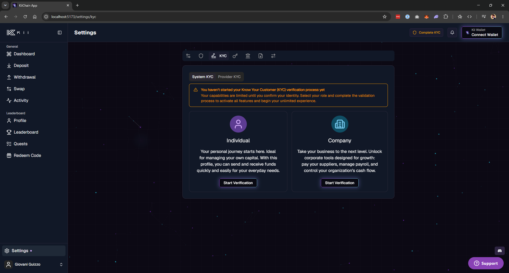
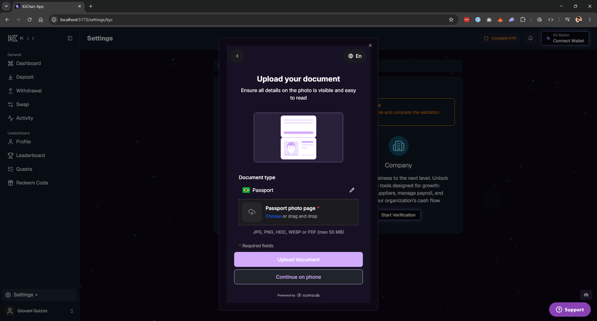
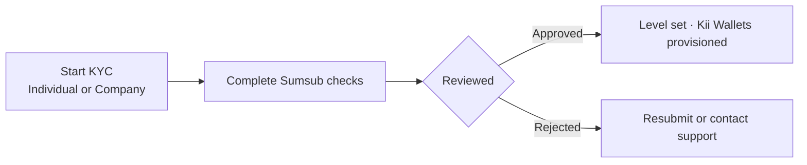
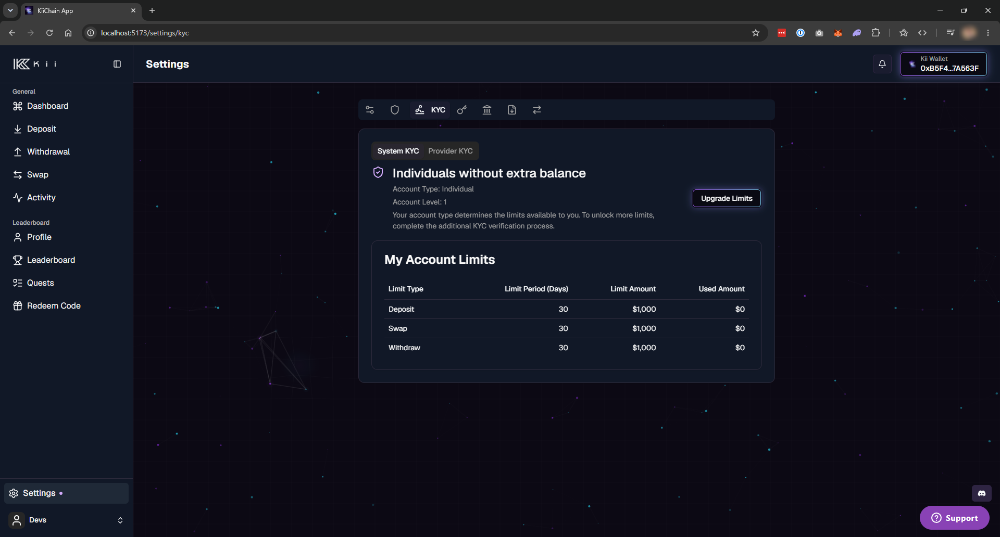
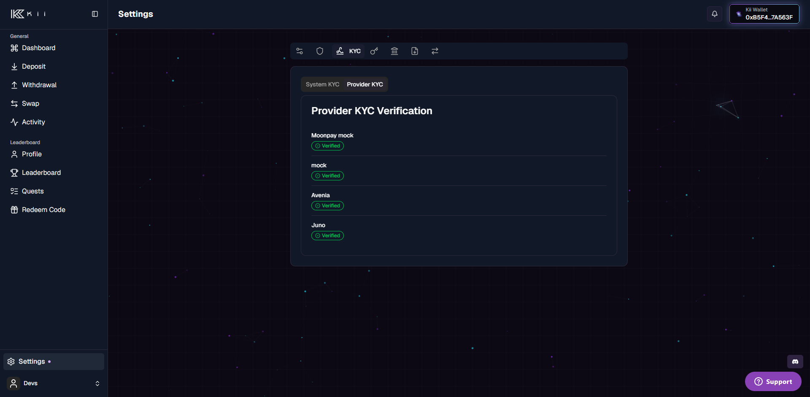

# KYC

KYC (Know Your Customer) is the gate that unlocks KiiChain Pay for an account. Until an account is verified it has **no Kii Wallets, no limits, and no access** to fiat rails. Completing KYC provisions the account's [Kii Wallets](internal-wallets.md) and sets its transaction limits.


KYC gates **Kii Wallets, fiat on-/off-ramps and limits** — not the chain itself. A user can still run **DEX swaps** anonymously from their own external wallet with no account and no KYC. See [Internal wallets](internal-wallets.md#how-funds-move).


There are **two independent verification flows**:

1. **System KYC** — KiiChain Pay's own identity verification. Sets your **account level** and platform-wide limits. **Every account completes this.**
2. **Provider KYC / KYB** — extra verification that a specific on-/off-ramp provider may require. **Most integrators never need this.** It applies only in very specific cases and countries, and KiiChain Pay prompts you when it does — most of the time you don't need to think about it.

## System KYC

### Account levels and limits

An account has a **level** (0, 1, or 2) and a **type** (individual or company). Level 0 means no KYC — no access. Levels 1 and 2 unlock rising limits, applied **per action** (`deposit`, `withdraw`, `swap`) in **USD** over a **rolling 30-day** window.

<table><thead><tr><th width="150">Account type</th><th width="100">Level</th><th>Limit per action (USD / 30 days)</th></tr></thead><tbody>
<tr><td>Individual</td><td>1</td><td>1,000</td></tr>
<tr><td>Individual</td><td>2</td><td>5,000</td></tr>
<tr><td>Company</td><td>1</td><td>10,000</td></tr>
<tr><td>Company</td><td>2</td><td>20,000</td></tr>
</tbody></table>


Level 1 is granted on first successful verification. Level 2 is a limit upgrade you request after reaching level 1. Individual accounts that pass a company verification become company accounts.


### The verification flow

System KYC uses the **Sumsub** identity platform, embedded directly in the KiiChain Pay app.

In the app, go to **Settings → KYC** and choose **Individual** or **Company** verification.

<figure><figcaption>
<strong>📸 Screenshot needed:</strong> Settings → KYC page showing the Individual and Company verification options (unverified state).
</figcaption></figure>

Starting verification opens the Sumsub flow, where the user completes identity checks (and, for companies, company documents).

<figure><figcaption>
<strong>📸 Screenshot needed:</strong> The Sumsub verification dialog embedded in the app (document upload / selfie step).
</figcaption></figure>

When the review is approved, the account's level and type are set and its **Kii Wallets are provisioned automatically**. The verified level and current limits are then shown in the dashboard.

<figure><figcaption>
<strong>📸 Screenshot needed:</strong> The verified state showing account level, type, and the limits table — including the "upgrade limits" action to move from level 1 to level 2.
</figcaption></figure>

### Individual vs. company

- **Individual** verification requires personal identity documents.
- **Company** verification (KYB) additionally requires a **company name** and company documentation, and typically covers the authorized representative and the business itself. Company accounts receive higher limits (see the table above).

### KYC status

The dashboard surfaces a status for the verification — for example _not started_, _pending_, _completed_, _verified_, or _rejected_ — with a contextual banner guiding the next step. A rejection may be final or ask the user to resubmit with better documents.

## Provider KYC / KYB


**Most integrators can skip this.** System KYC (above) is all you need in the common case. Provider KYC is required only in very specific cases and specific countries, where a third-party on-/off-ramp provider imposes its own compliance requirements. **You don't need to seek it out in advance** — when a transaction needs it, KiiChain Pay prompts you to complete that provider's verification.


Some on- and off-ramp providers are third parties with their **own** compliance requirements. In those cases, an account must complete that provider's KYC (or KYB, for companies) before transacting through it — this is **separate** from system KYC above, and it's requested only when needed.

When it applies, the **KYC** page's **Providers** tab lists the relevant provider with its verification status (e.g. _pending_, _processing_, _verified_, _rejected_).

<figure><figcaption>
<strong>📸 Screenshot needed:</strong> The Providers tab of the KYC page, listing providers with their KYC status badges.
</figcaption></figure>

When prompted, starting provider verification opens the provider's flow (a redirect rather than an embedded SDK). **Company (KYB)** accounts complete an extra step — an authorized-representative flow plus a basic company-data step — whereas individuals complete a single flow.


Provider verification is per provider: verifying with one provider does not verify you with another. When a provider is required, check its status before routing a transaction through it.


## Next steps

- [Internal wallets](internal-wallets.md) — provisioned automatically once system KYC is approved.
- [Creating an on-ramp](../guides/quick-start/creating-an-on-ramp.md) — where provider KYC may come into play.
