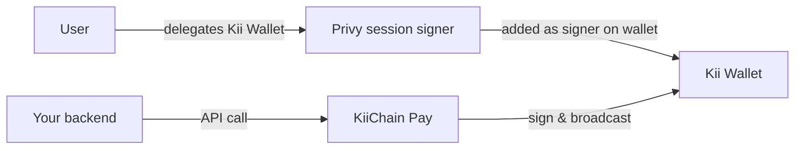
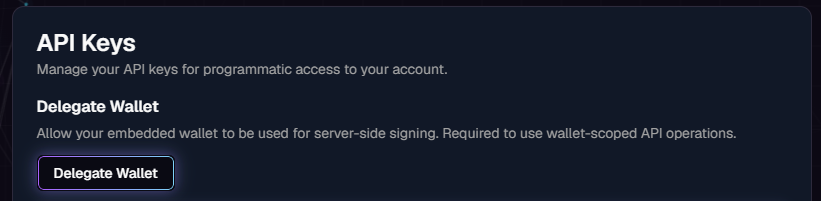
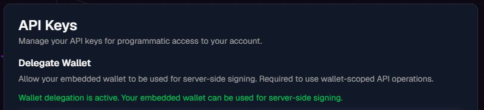

# Privy delegated access

Because Kii Wallets are [non-custodial](internal-wallets.md), KiiChain Pay cannot sign a transaction from a user's wallet on its own — the keys belong to the user. **Delegated access** bridges that gap: the user authorizes the platform's signer to act on their embedded wallet, so your backend can sign and broadcast wallet operations through the API without prompting the user for every transaction.

Delegation is built on [Privy](https://privy.io)'s **session signers**. It is explicit, granted by the user, and required for any wallet-scoped API operation.


Delegation applies **only to Kii Wallets**. A user transacting with their own external wallet signs each transaction themselves — no delegation needed.


## Why delegate

Without delegation, every on-chain action would need the user to sign in real time — impractical for automated, server-driven payments and FX. With delegation:

- Your backend can execute swaps, off-ramps and transfers from the user's Kii Wallet via the API.
- No per-transaction signing prompt.
- Transactions remain **gas-sponsored** by KiiChain Pay.


Delegation authorizes **signing on the user's own wallet**. Funds still move only to the destinations your API calls specify; the platform signs on the user's behalf, it does not take custody of the keys.


## How it works

Under the hood, delegation adds the KiiChain Pay **session signer** to the user's embedded wallet (Privy's `addSigners`). Once added, the platform can call Privy's wallet API to sign and broadcast transactions from that wallet. Privy exposes a `delegated` flag on the wallet, which KiiChain Pay reads to know whether server-side signing is available.

## Granting delegation (dashboard)

The user grants delegation once, from the dashboard. In **Settings → API Keys**, use the **Delegate Wallet** action.


The Kii Wallet must exist first, which means **KYC must be complete** (wallets are provisioned on KYC approval). See [KYC](kyc.md).


<figure><figcaption>
Settings → API Keys: the <strong>Delegate Wallet</strong> action, before delegation.
</figcaption></figure>

After confirming, the wallet shows a **delegation active** state:

<figure><figcaption>
Once delegated, the panel confirms the Kii Wallet can be used for server-side signing.
</figcaption></figure>

## What delegation unlocks

With a delegated wallet, wallet-scoped API operations — FX swaps, off-ramp settlements — are signed server-side from that user's wallet. Without delegation, those operations return an error.

The [upcoming "send tokens from a Kii Wallet" endpoint](internal-wallets.md#accessing-wallets-via-the-api) will also require delegation.

## Next steps

- [Generating API keys](generating-api-keys.md) — the key that authorizes delegated operations.
- [Creating an FX swap](../guides/quick-start/creating-an-fx-swap.md) — a delegated operation end to end.
