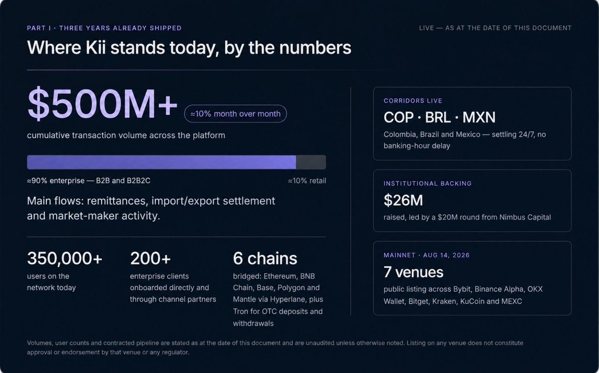

# Part 1: Inception

KiiChain did not begin as a blockchain. It began as a payments business.\
\
The team behind Kii Global spent its first years operating an over-the-counter (OTC) trading and B2B payments desk in Latin America moving real money for real businesses, and running directly into the structural problems that define cross-border finance in emerging markets: shallow dollar liquidity, banking hours that don’t match a 24/7 economy, correspondent-banking chains that add days and fees to every transfer, and local currencies that the global FX system treats as peripheral. That operating experience is the reason KiiChain is designed the way it is. The chain was built to industrialize a payments business that already worked, not to find a use case for a chain that already existed.The problems of pre-existing infrastructure and Kii’s solutions to this can be further explained in these two articles:

* [Stablecoins are changing FX markets, but challenges remain](https://medium.com/cosmos-blockchain/stablecoins-are-changing-global-fx-markets-but-challenges-remain-f5d062bb6a15)
* [Why FX Needs Its Own Onchain Architecture - And How KiiChain Built It](https://x.com/KiiChainio/status/2058960870978253164)

What follows is the build history, year by year. The pattern is consistent: prove the flow off-chain, then move it on-chain by solving specific problems; ship infrastructure, then harden it with audits; grow the network, then decentralize it.

### 2023: From a trading desk to a platform

* Q1: KiiChain Devnet. The first development network went live, establishing the base architecture the team would iterate on for the next three years. This devnet laid the foundation for the core infrastructure on which all Kii services will ultimately be deployed.
* Q2: KIIEX build begins. The OTC operation was re-architected from a manual desk into scalable exchange technology. This is the origin of KIIEX, a CLOB conceived specifically for FX and payments rather than as a generic crypto spot venue.
* Q3: KIIEX Beta. The exchange launched in beta, testing trading and payments on the mainnet in a whitelist-only environment. During this period, the desk-plus-exchange operation processed over $50M in total volume and reached viability, a rare and important signal for infrastructure at this stage, because it proved demand and unit economics before any token existed ([kiiex.io](http://kiiex.io/)).
* Q4: Kii mobile wallet. A mobile wallet was developed for version 1 of the testnet, extending the platform from an institutional desk toward an end-user product ([App Store Reference](https://apps.apple.com/co/app/kii-mobile/id6474740411)).

### 2024: The chain takes shape

* Q1: KiiChain Testnet V1. The first full testnet launched, built on the Cosmos SDK with CometBFT consensus, the foundation that gives KiiChain fast, deterministic finality and native IBC interoperability ([kii Github](https://github.com/KiiChain/kii))
* Q2: KIIEX. KIIEX left beta and went live with multi-varied APIs, onboarding 50+ enterprise clients with access to a combined base of 200,000+ users. The platform crossed[$200M+](https://x.com/search?q=%24200M%2B\&src=cashtag_click)in cumulative trading volume and built out 30+ strategic partnerships across the region. We saw heavy traction with enterprises and individual users alike, because KIIEX has substantial advantages over traditional rails:

1. Full API-powered payins and payouts.
2. 24/7 settlement, with no banking-hour or weekend delays. Little to no need for FX clearance.
3. On-chain FX withdrawals in non-dollar stablecoins where clients can manage their own disbursements.
4. Third-party payment capabilities for licensed providers.
5. Direct settlement to popular banks and fintech apps with fast settlement.
6. A 24/7 OTC desk with live chat and support teams

* Q3: Testnet V2 (EVM). Testnet V2 introduced an EVM execution module, making the chain fully EVM-compatible and allowing Solidity contracts to deploy directly alongside CosmWasm, a deliberate choice to meet both Web2 and Web3 builders where they already are[(kii2 Github](https://github.com/KiiChain/kiichain2)).
* Q4: Testnet V3 (the product modules). V3 upgrades introduced the modules that define KiiChain as a product, not just a chain: a new EVM module, the RWA protocol and the Oracle module. This is the quarter KiiChain became an on-chain FX and real-world-asset platform in architecture, not just ambition ([kiichain Github](https://github.com/KiiChain/kiichain)and[Modules Documentation](https://docs.kiiglobal.io/docs/build-on-kiichain/modules))

### 2025 Incentivized testnet, upgrades, and the road to mainnet

* Q1: Incentivized testnet (Oro). The incentivized testnet launched with XP and Oro loyalty points and on-chain tasks, seeding a real community of validators, builders, and users ahead of mainnet (see blog:[Testnet Oro Blog](https://kiichain.medium.com/kiichain-testnet-oro-airdrop-join-the-builders-embedding-the-future-of-finance-c96d7dbc4665)).
* Q2: Interoperability and rewards. IBC, Wasm, and EVM upgrades landed together, alongside a utility rewards module broadening what could connect to the chain and how participants earn from it ([Modules Documentation](https://docs.kiiglobal.io/docs/build-on-kiichain/modules)).
* Q3: Stablecoin gas and the first audit. EVM gas-fee abstraction for stablecoins shipped, letting users pay network fees in stablecoins rather than needing to hold the native token first, a critical UX unlock for a payments network. The first security audit (Webisoft) began in the same quarter.
* Q4: Testnet final version launched. The Testnet with all functionalities was completed, moving the network into a production-grade, controlled environment ahead of public mainnet launch ([Final Testnet Github Repo](https://github.com/KiiChain/kiichain)).

### 2026 Public network, public token

* Q1: Hacken Audit. A second, independent audit (Hacken) was conducted on the private mainnet, layering defense-in-depth on top of the Webisoft work ([https://hacken.io/audits/kiichain/l1-kiiex-l1-audit-mar2026/](https://hacken.io/audits/kiichain/l1-kiiex-l1-audit-mar2026/)). The audit finished on March 16th, with the Hacken Dual Defences finishing on June 8th ([https://hackenproof.com/audit-programs/kiichain-l1-dualdefense-audit](https://hackenproof.com/audit-programs/kiichain-l1-dualdefense-audit)).
* Q2:[The KiiChain App](https://pay.kiichain.io/)was launched in Beta as an evolution to KIIEX and developed its own hybrid centralized-decentralized infrastructure called an AQN ([Atomic Quote Network](https://x.com/KiiChainio/status/2058960870978253164)). As the network began expanding into new on-chain FX territories.
* Q3: Public sale, TGE, and mainnet. The public sale of KII opened on the Sonar by Echo platform (owned by Coinbase) with over 9,000 registrations. The sale was capped at $1m USD and sold out in three days.The sale was conducted through Sonar by Echo, a platform owned by Coinbase, under that platform's KYC, AML, and jurisdictional eligibility procedures, which screened and excluded participants in restricted jurisdictions
* On August 14th 2026, KII published its mainnet and had its public listing with the following partners: Bybit, Binance Alpha, OKX Wallet, Bitget, Kraken, KuCoin and MEXC. A partnership was also established with Hyperlane where official bridges were set up between KiiChain and Ethereum, BNB Chain, Base, Polygon and Mantle ([Hyperlane Bridges Documentation](https://docs.kiiglobal.io/docs/learn/getting-started/bridge)).

Where that leaves us today The[KiiChain App](https://pay.kiichain.io/)(Kii) launched in beta as the next step after KIIEX. It takes everything the exchange taught us about liquidity and settlement and rebuilds it around a system we built ourselves: the Atomic Quote Network (AQN). It's also the app driving our expansion into new on-chain FX territories.We built the AQN because FX isn't spot crypto trading, and the usual on-chain models don't fit it. An AMM loses too much to slippage and impermanent loss on the thin, volatile pairs typical of emerging-market currencies. An order book needs deep, always-on liquidity those pairs don't have. So the AQN borrows how traditional FX actually finds a price (RFQ, or request-for-quote) and settles it on-chain. It's TradFi's way of pricing, and Blockchain's way of paying.Three smart contracts make that happen, each with one job:

* Router finds the best price. It takes your order, compares the competing quotes, picks the best path (a direct local pair, or one routed through USDT/USDC if that's cheaper), and passes it on.
* Fulfillment handles the liquidity. It's the market-maker side, making sure the counter-currency is actually posted and handling the accounting, fees, and rewards for whoever fills the order.
* Settlement moves the money. It runs the swap in a single transaction, paying out both sides at once, with quote expiry and slippage checked at the moment it executes. This is the "atomic" part.

For more information on the App, visit the documentation here ([Intro to Kii App](https://docs.kiiglobal.io/docs/kiichain-pay/introduction)) and review API documentation here ([Kii APIs](https://docs.kiiglobal.io/docs/kiichain-pay/api-reference))Here's a snapshot of where Kii stands today, by the numbers:

* Over $600M in cumulative transaction volume across the platform, growing at roughly 10% month over month. About 90% of that volume comes from enterprise clients, through both a B2B model and a B2B2C model, with retail accounting for the remaining 10%. The main flows moving across Kii are remittances, import and export settlement, market-maker activity, and more. On the enterprise side, Kii runs a strong business development motion, onboarding both direct clients and channel partners, backed by a six-person regional business development and marketing team and a steady on-the-ground presence at industry conferences that builds brand awareness and traction. On the retail side, that reach extends through B2B2C distribution, a remittance service, and on-chain financial services.
* 350,000+ users, and an incentivized testnet (Oro) that drew over 366,000 participants.
* Over 200 enterprise clients.
* $26M raised from institutional investors, led by a $20M round from Nimbus Capital, alongside In On Capital, Super Cycle Capital, Kahuna Ventures, WTG Ventures, Access Ventures, and Latam Nodes.
* $5.4B in notional asset value covered by signed tokenization agreements. These represent contracted pipeline only; assets are not yet issued or held on-chain., and connectivity to 100+ blockchain ecosystems for unified liquidity routing.
* A working local-stablecoin flywheel: Executing 24/7 on-chain FX swaps, solving for limited banking hours, slow settlements and centralized rebalancing.

<figure><figcaption></figcaption></figure>
