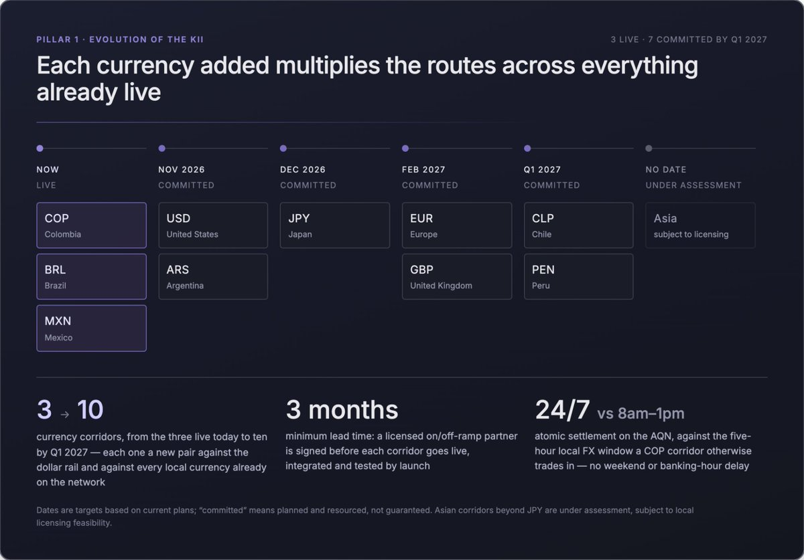

# Part II: Pillar 1

The product roadmap is organized around three pillars we are building now, followed by future concepts the network enables. The strategy is consistent with how KiiChain was built: each pillar extends an asset or flow that is already live, rather than betting on a new one.The three near-term pillars are:(1) Kii expanding on-chain FX, territories, and protocol rails (2) Yield Vaults, (3) On-Chain Financial Services.

### Pillar 1: Evolution of the Kii

**Problem**. Emerging-market FX is fragmented and closed. Dollar liquidity is shallow, banking hours do not match a 24/7 economy, and correspondent-banking chains add days and fees to every transfer.

**Kii’s insight.** FX is not spot crypto. Automated market makers bleed value on thin, volatile pairs, and order books need depth these currencies do not have. So price the way FX actually prices, using request-for-quote, and settle the way blockchains settle: atomically, in one transaction.

**Product**. The Atomic Quote Network, and the currency corridors and protocol rails routed across it.

**Advantage**. 24/7 settlement with no banking-hour or weekend delay. Local-currency routing rather than a forced dollar leg. Network fees typically measured in cents, and no correspondent banking. Every corridor runs on local licensed providers, so it works end to end rather than only on-chain. And each new currency multiplies the tradable routes across everything already live, so the network compounds.

**Expanding FX and territories**

The core work here is turning a single-corridor network into a many-corridor one. Expansion has three tracks:

**New currency corridors**. Onboard additional local-currency stablecoins and fiat liquidity across Latin America first, then broaden to other emerging markets with the same structural profile shallow dollar liquidity and peripheral-currency classification. Each new stablecoin and fiat is a new pair against USDT/USDC and against every other local stablecoin already on the network, so the number of tradable routes grows faster than the number of currencies added.Live Today

* \[Live] COP (Colombia)
* \[Live] BRL (Brazil)
* \[Live] MXN (Mexico)

We started with Colombia, Brazil, and Mexico on purpose: together they gave us the hardest, most useful conditions to prove the model, and the right base to grow from. COP was the anchor. It's a non-deliverable currency, so it's genuinely hard to access, with more friction (FX hours only operate from 8am - 1pm) and barriers than most, which meant our service solved a real problem for users from day one. It also made for a healthier order book: COP net flows run opposite to Brazil and Mexico, so the three can be crossed against each other into a more natural, balanced book, and very few players have strong COP flow to begin with, which gave us a real edge. All three settle against the dollar, so rebalancing between USD and USDT stayed simple across the whole book. Additionally, all three have large remittance and import/export markets, so we could solve clear, painful business problems for a lot of people at scale.Proving the model in these three is what sets up the rollout into the larger markets that follow.Rolling out

* \[Committed – Nov 2026] USD (United States) Brings U.S. liquidity and payments online, along with FX infrastructure between USD and other assets.
* \[Committed – Nov 2026] ARS (Argentina), starting with ARS/USDT liquidity and payments.
* \[Committed – Dec 2026] JPY (Japan)liquidity and payments. Additional Asian corridors are under assessment, subject to local licensing feasibility.
* \[Committed – Feb 2027] EUR / GBP (Europe) – liquidity and payments in both euros and pounds
* \[Committed – Q1 2027] More LatAm currencies – CLP (Chile) and PEN (Peru) live by Q1 2027

Licensed last-mile coverage. On/off-ramp and fiat settlement remain dependent on licensed, KYC-compliant operators in each market. Territory expansion therefore means signing and integrating regulated on/off-ramp partners jurisdiction by jurisdiction, so a corridor is genuinely usable end-to-end rather than only settleable on-chain.

* A licensed on/off-ramp partner is signed in each market at least 3 months before that corridor goes live, with integration completed and tested by launch. Additional partners are added within 3 - 6 months of launch to avoid single-provider dependency, and coverage in the next target jurisdiction begins within 3 months ahead of its own corridor date.

Every corridor Kii operates runs on local, licensed, regulated providers in that market rather than a single offshore intermediary. That's what lets each corridor settle end to end and stay compliant jurisdiction by jurisdiction. Specific partner names are confidential, but the profile of each is below.Current partners include:

* \[Live] COP (Colombia): a licensed bank regulated and supervised by the national financial superintendent (Superintendencia Financiera), plus two local liquidity partners aiding in FX and disbursements.
* \[Live] BRL (Brazil): two licensed, regulated entities covering FX and payments.
* \[Live] MXN (Mexico): two licensed, regulated entities covering FX and payments.

Target markets, partnerships already secured:

* \[Signed] USD (United States): an MTL- and MSB-licensed entity (money transmitter and money services business) providing both virtual bank accounts and payments.
* \[Signed] ARS (Argentina): a licensed payment provider covering FX payments and virtual accounts.
* \[Under assessment] JPY (Japan), and EUR/GBP (Europe): local licensed and regulated providers currently being onboarded, to be confirmed.

<figure><figcaption></figcaption></figure>

Expanding the protocol railsAlongside currency reach, the network extends the protocols it natively supports, because the more chains and contract environments KiiChain speaks, the more liquidity and more builders it can bring onto its FX layer:Advanced on-chain FX swap page. Today's swap page works network by network: you pick a chain, then swap assets on it. The advanced page flips that around and puts the currency first. You choose the fiat pair you want, say COP to BRL or USD to MXN, enter an amount, and Kii handles the routing, network, and settlement underneath. It makes on-chain FX feel like a normal currency exchange: pick two currencies, see the rate, swap.

* \[Live]: Simple swap page for swapping assets on a selected network.
* \[Committed – Sep 2026]:Advanced fiat-pair swap page for direct on-chain FX

Full Tron protocol support. Tron carries one of the largest share of USDT in circulation and is the dominant dollar rail across emerging markets, where TRC-20 USDT is what people and businesses actually hold and move. Full Tron support connects that liquidity base directly into KiiChain’s FX layer, and will allow for cross-chain DEX swaps, FX swaps and more. The single biggest pool of the exact asset the network is built to route, turning the largest emerging-market dollar network into a first-class on-ramp for Kii FX corridors.

* \[Live] Deposits and withdrawals for OTC swaps.
* \[Committed – Sep 2026] Swap and bridge USDT TRC-20 integration on Kii with Tron-sourced USDT routable into every live FX corridor from day one.

CosmWasm protocol. Full CosmWasm support brings a mature, Rust-based smart-contract environment alongside the existing EVM layer. The RWA protocol already uses CosmWasm; extending it network-wide gives builders a second, high-assurance contract surface for vaults, compliance logic, and structured products, and lets KiiChain draw on the wider Cosmos developer base without giving up EVM compatibility. This also enables the support of other CosmWasm based networks.

* \[Committed – Oct 2026] Network-wide CosmWasm enablement on testnet with developer documentation updated for CosmWasm interoperability tooling released alongside.

Multistep pay provider. Today KiiChain Pay unifies on-ramp, off-ramp, FX swap, and DEX swap as routes; the multistep pay provider chains them into a single orchestrated payment. One instruction can move funds through several legs. For example, on-ramp in one currency, an FX swap, and off-ramp in another, settling atomically end-to-end so a payer states intent (“pay this beneficiary this amount in their currency”) and the network routes every intermediate step. This is what turns the settlement layer into a true payments product for businesses that don’t want to manage the individual hops.

* \[Committed – Oct 2026] Two-leg orchestration live, with full multi-leg settlement with automatic route selection deployed to only support networks and territories. The functions will be API available.
