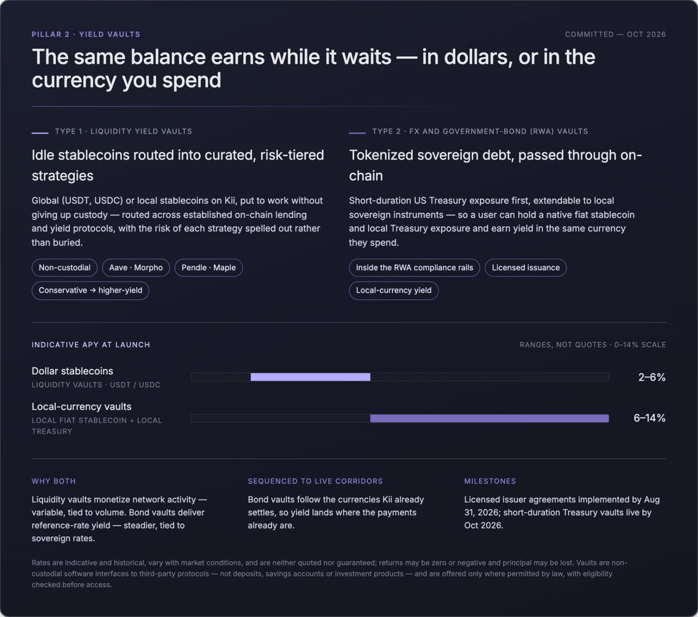

# Part II: Pillar 2

### Pillar 2: Yield vaults

**Problem**. A balance sitting still in an emerging market is a balance losing ground. The alternatives are a local bank account with poor rates, or dollar yield that is out of reach for most businesses and people there.

**Kii’s insight.** The money is already on Kii. Yield should be a property of that balance, not a separate product a user has to leave the network to find.

**Product**. Two vaults over assets Kii already handles: liquidity vaults routed into established on-chain lending and yield protocols, and FX and government-bond vaults holding tokenized sovereign debt.

**Value proposition.** The same balance used for FX and payments can be put to work while it waits, without leaving Kii and without giving up custody. Returns are variable and not guaranteed.

* Yield in local currency, not just dollars. A user can hold, and seek yield in, the currency they actually spend.
* Sequenced to live corridors: bond vaults follow the currencies Kii already settles, so yield lands where the payments already are.
* Non-custodial and compliant: deposits stay the user’s, and issuance runs inside the RWA protocol’s compliance rails.

**Availability**. Vaults are available only where permitted by law, and eligibility is checked before access. Any rate shown in this document is indicative and variable, not a quoted or guaranteed return.

**Liquidity yield vaults**

These vaults let anyone holding stablecoins on Kii, global (USDT, USDC) or local, put idle balances to work and earn yield without giving up custody of their funds. They run on non-custodial yield infrastructure: your deposit stays yours while it's routed into curated, risk-tiered strategies across established on-chain lending and yield protocols. Potential venues include leading lending markets such as Aave and Morpho, and yield protocols such as Pendle and Maple. APY can range from 2% to 6% on most vaults, and can change depending on a multitude of market factors. You pick the profile that fits you, from conservative to higher-yield, and you can see exactly where the return is coming from. It's all on-chain and transparent, with the risk of each strategy spelled out rather than buried.

* \[Committed – Oct 2026] First vaults live on USDT/USDC and the initial local-currency pairs, with a curated set of risk profiles at launch. More strategies, more supported assets, and full on-chain reporting of yield sources, utilization, and risk follow as the product matures.

FX and Government-bond (RWA) yield vaultsThe second type holds tokenized government bonds, starting with short-duration US Treasury exposure and extendable to local sovereign instruments, and passes the underlying yield through to depositors on-chain. This gives an emerging-market user or business a way to hold a dollar-denominated, yield-bearing, sovereign-backed asset directly from a stablecoin balance. Issuance stays within the RWA protocol's compliance rails (identity, eligibility, licensed issuance), so the product is institutional-grade rather than synthetic. The standout for emerging markets is the FX side: local-currency vaults let users hold a native fiat stablecoin and local Treasury exposure to earn yield in that same currency, typically anywhere from 6% to 14% APY. Current examples include a Colombian peso yield \~9%, a Brazilian real vault at roughly \~11%, and a Mexican peso vault at roughly \~5%, with rates varying by currency and market demand and always indicative rather than guaranteed. For a business or person in an emerging market, this turns a stablecoin balance into a productive account: the same funds you use for FX and payments on Kii can earn a competitive local-currency yield in between transactions.Note on rates. Rates referenced above are indicative and historical, vary with market conditions, and are neither quoted nor guaranteed. Vaults are not offered in jurisdictions where they are not permitted.

* \[Committed – Oct 2026] Licensed issuer agreements implemented by August 31st, 2026, with short-duration Treasury vaults live by October, 2026.

Why both. The two vault types serve two different demands from the same balance: FX vaults monetize network activity (variable yield, tied to volume), while bond vaults deliver reference-rate yield (steadier, tied to sovereign rates). Offering both lets a treasury split idle balances between “earn from the network” and “park in sovereign-backed yield” without leaving Kii. 

<figure><figcaption></figcaption></figure>
