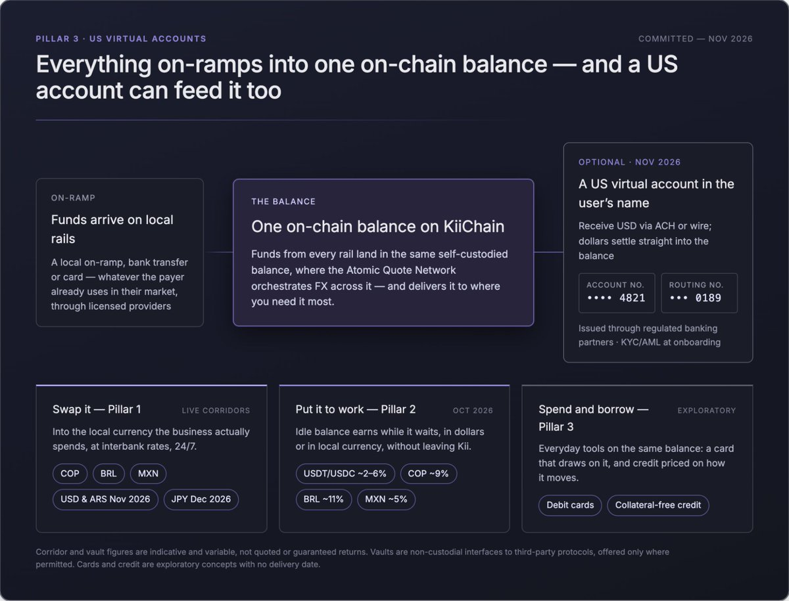

# Part II: Pillar 3

### **Pillar 3: On-Chain Financial Services**

**Problem**. In emerging markets, the hard part is not spending dollars. It is receiving and holding them.\
\
**Kii’s insight.** Bankable US account details on top of an on-chain balance solve the receiving problem; the rest of the stack already solves what happens next.\
\
**Product.** US virtual accounts first, then everyday financial tools built on the same balance.\
\
**Advantage.** Dollars arrive on rails counterparties already use and land on-chain, where they can be swapped into local currency (Pillar 1) or put to work (Pillar 2) immediately. Accounts are issued through regulated partners and it lets a user in supported territory receive and hold dollar.

The third pillar addresses the demand underneath everything else in emerging markets: access to a wider range of financial services. A US virtual account gives a KiiChain user their own US account details (an account and routing number) capable of receiving USD via standard rails (ACH/wire), with incoming dollars settling into their on-chain balance as stablecoins.How it fits the stack. Virtual accounts sit on top of KiiChain Pay’s existing on/off-ramp architecture and its licensed-operator model.&#x20;

The account is issued through regulated banking partners; the on-chain leg is native KiiChain. This is a deliberately partnership-and-compliance-heavy product; it lives or dies on the banking relationships and KYC/AML program behind it, and is sequenced accordingly.

* \[Committed – Nov 2026] US Virtual accounts

Beyond virtual accounts, Pillar 3 puts everyday financial tools on top of the same on-chain balance, so the money a user holds on Kii can be spent, and eventually borrowed against, without leaving the network.The following are exploratory concepts under evaluation. They are not committed products, carry no delivery date, and will proceed only where the necessary licences, card-scheme approvals, and lending authorisations are obtained, directly or through licensed partners.

* \[Exploratory] Debit cards. On-chain stablecoin debit cards that spend straight from a user's Kii balance. There's no separate bank account or top-up in the middle: the card draws directly on the stablecoins the user already holds and works anywhere cards are accepted. It's the simplest bridge between an on-chain dollar and real life, whether that's buying groceries, paying a supplier, or pulling out cash.
* \[Exploratory] Credit cards. A collateral-free line of credit built for micro-lending, aimed straight at the credit gap that defines emerging markets. In most of these economies, the missing piece isn't payments; it's credit. Around 40% of formal small businesses in developing countries have financing needs that go unmet, a shortfall the IFC estimates at roughly $5.2 trillion, and well over a billion adults have no formal credit history at all. Without a score, a small loan to cover a slow month or buy inventory is simply out of reach, and people get pushed toward informal lenders at punishing rates.

Kii can close part of that gap using data the network already holds. Because a user's dollars arrive through their virtual account, move through FX, sit in vaults, and get repaid over time, Kii can build a genuine on-chain picture of how someone actually manages money and extend small, collateral-free lines of credit based on that behavior rather than a bureau score they'll never have. In practice, that's real microfinance: modest, unsecured credit that helps a family smooth a rough month or a small business buy stock or handle an emergency, repaid from the same inflows the network can already see. And because it needs no collateral, it reaches exactly the people traditional lending leaves out.

<figure><figcaption></figcaption></figure>

### Regulatory status and jurisdictional availability

This document is distributed internationally and is intended to be read alongside the notice above.

* Nothing in this document is an offer to sell, a solicitation of an offer to buy, or an investment recommendation in any jurisdiction, including the Republic of Korea.
* Nothing here is a promise or indication of profit, return, or price appreciation of any digital asset, including KII.
* The listing or trading of KII on any exchange does not constitute approval, endorsement, or verification by any regulator or exchange. Listing decisions rest with the venues concerned.
* Products described are offered by KiiChain only where permitted, and where a licence is required they are provided by licensed third parties. Where local licensing is absent, the product is not offered in that jurisdiction.
* Statements about future corridors, dates, partnerships and authorisations are forward-looking. They reflect current intention, not commitment, and actual outcomes may differ.
* Traction figures, volumes, user counts and contracted pipeline are stated as at the date of this document and are unaudited unless otherwise noted.
* Marketing and distribution are subject to local law in each market. This document should be reviewed by local counsel before use in any specific jurisdiction.
* On/off-ramp and liquidity services are available only where permitted by applicable law and, where required, are delivered through licensed issuers and distributors. Availability differs by jurisdiction, and jurisdictions without local licensing are excluded.
* Yield vaults are non-custodial software interfaces to third-party protocols. They are not deposits, savings accounts or investment products, are not offered, guaranteed or insured by any bank or deposit-protection scheme, and no return is promised or fixed. Returns are variable, may be zero or negative, and principal may be lost.
* Tokenized government bonds are securities, issued solely by licensed third-party issuers under applicable securities law. KiiChain provides technical infrastructure only and does not issue, underwrite, distribute, custody or advise on these instruments. Access is restricted to eligible investors in permitted jurisdictions.
* Virtual accounts are issued and operated by licensed third-party banking and money-transmission partners. KiiChain is not a bank, deposit-taking institution or money transmitter and does not hold customer fiat. Balances are not insured by any deposit-protection scheme.
