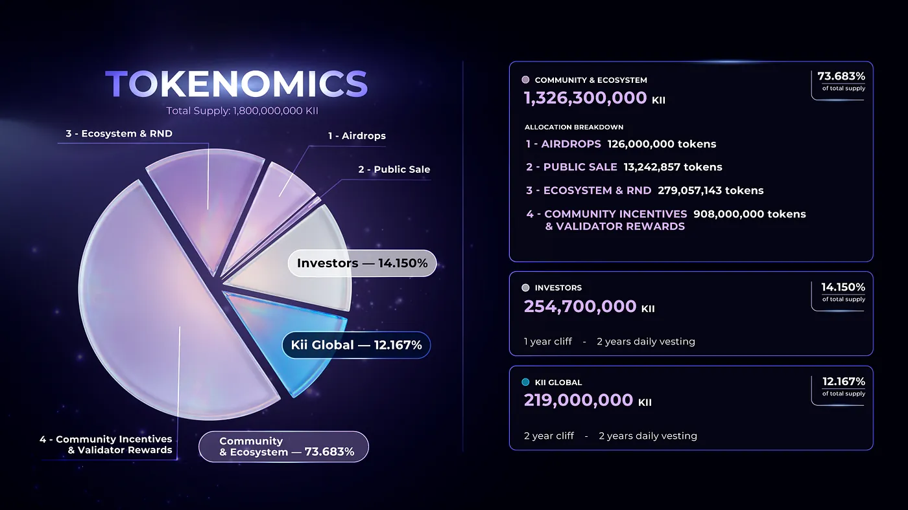
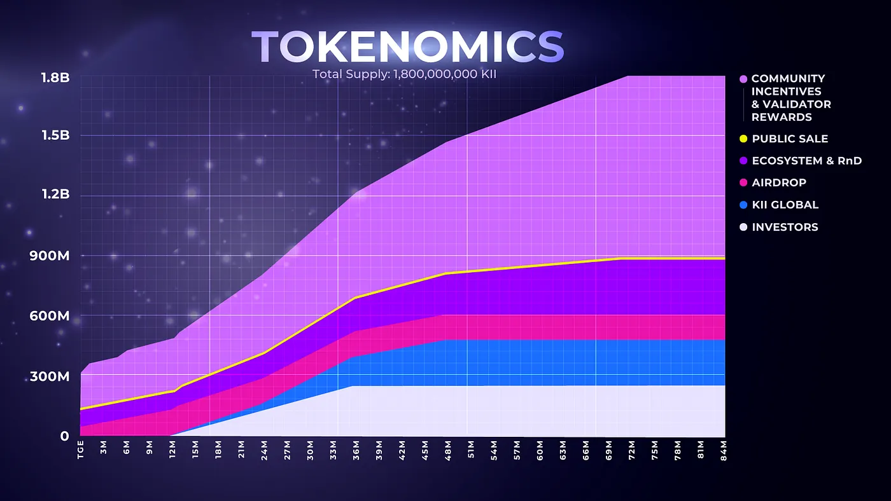

# KiiChain Tokenomics

In an industry increasingly defined by short-term incentives, aggressive unlocks, and misaligned capital structures, KiiChain’s tokenomics are designed around a different philosophy. Its tokenomics are not engineered to maximize early speculation or short-term price action, but to support long-term economic activity, real usage, and durable network effects.

The model combines traditional financial principles, discipline, alignment, and capital efficiency, with the transparency, programmability, and community participation enabled by Web3.

### A Foundation Built on Discipline, Not Hype 

Many token economies struggle with the same structural challenges: excessive investor concentration, aggressive emissions, limited utility, and incentives that prioritize short-term activity over sustainable network growth. KiiChain takes a different approach.

<figure><figcaption></figcaption></figure>

Its tokenomics are designed around four principles:

* **Long-term alignment:** Extended vesting schedules across key allocations.
* **Community participation:** More than 72% is allocated across Community and Foundation initiatives supporting ecosystem growth.
* **Real utility:** KII is designed to support activity across KiiChain’s financial infrastructure.

The objective is straightforward: allow network participation and real usage to grow alongside token distribution.

### Breaking Down the Allocations 

KiiChain has a fixed maximum supply of 1,800,000,000 KII tokens.

Press enter or click to view image in full size

<figure><figcaption></figcaption></figure>

\
Investors — 14.15%

Investors who backed KII in private rounds hold 14.15% of total supply (254,700,000 KII). We made a deliberate choice to keep every one of these tokens locked at TGE.

Investor allocations sit behind a twelve-month cliff, then unlock across the next 24 months. The structure rewards early conviction and ties outside capital to the long horizon that building an open intelligence ecosystem demands.

#### Kii Global — 12.167% 

A total of **219,000,000 KII** is allocated across the contributors responsible for building and supporting KiiChain:

* **Team:** 171,000,000 KII — 9.500%
* **Contractors:** 12,000,000 KII — 0.667%
* **Advisors:** 36,000,000 KII — 2.000%

The team allocation carries a **2-year cliff followed by a 2-year vesting period**, creating long-term alignment between the people building the infrastructure and the ecosystem they are building for. **Contractors and advisors follow a 1-year cliff followed by a 2-year vesting period**, further reinforcing long-term commitment and alignment across key contributors.

#### Community & Ecosystem — 73.68% 

A total of 1,326,300,000 **KII (73.68%)** is allocated to Community and Foundation initiatives, representing the largest share of the KII supply. This allocation is designed to **support network participation, ecosystem growth, liquidity, and the long-term development and sustainability of KiiChain.**

The allocation is distributed across four key areas:

* **Airdrops:** 126,000,000 KII (7.000%)
* **Public sale:** 13,242,857 KII (0.736%)
* **Ecosystem & RnD:** 279,057,143 KII (15.503%)
* **Community Incentives & Validator Rewards:** 908,000,000 KII (50.444%)

Community and Ecosystem allocation follow a long-term activity-driven distribution model. Tokens are progressively deployed as the ecosystem grows, based on network participation, community program, liquidity needs, grants and strategic ecosystem development

* Airdrop

A total of 7% of the token supply is allocated to the airdrop. Of this, 30% unlocks at TGE. The remaining supply is released monthly over the following 12 months.

* Public Sale

A total of 0.736% of the token supply is allocated to the public sale. This bucket covers tokens allocated to community members who participated in the Sonar public sale. 0.275% of token supply is unlocked at TGE. The remainder unlocks over the following 24 months, according to the vesting schedule selected by the user.

* Ecosystem and R\&D

The Ecosystem and R\&D bucket contains tokens allocated towards foundation operations, business development, liquidity, and partnerships. It also includes the liquidity tokens provided to market makers for maintaining liquidity across centralized and decentralized exchanges.

A total of 15.5% of the token supply is allocated to this bucket. Of this, 5% is unlocked at TGE. The remainder is subject to a 12-month cliff, after which it unlocks linearly over the following 60 months.

* Community Incentives and Validator Emissions

A total of 50.444% of the token supply is allocated to this bucket. It funds community programs, grants, and ecosystem incentives, as well as delegator and validator rewards. It also includes the allocation provided to centralized exchanges for initial distribution to users.

Vesting for this bucket works as follows:

\- 10.08% of the token supply is unlocked at TGE.

\- Approximately 8.3 bips of the token supply is unlocked every month from TGE as validator emissions, continuing for 72 months.

\- An additional 2% of the token supply unlocks in month 2 within the community initiatives portion of the bucket.

\- A further 1% of the token supply unlocks in month 6.

\- The remainder is subject to a 12-month cliff and unlocks through to month 72.

Community & Foundation allocations follow a long-term, activity-driven distribution model rather than aggressive fixed unlocks. **Tokens are progressively deployed as the ecosystem grows,** based on network participation, community programs, liquidity needs, grants, and strategic ecosystem development.

These allocations are designed to enter circulation progressively over long-term distribution programs extending for up to 10 years, helping align token circulation with real network growth and demand.

### The KII Token: Utility at the Core 

KII is the utility token powering participation across KiiChain’s financial infrastructure. Its utility is centered on network usage and active ecosystem participation rather than mechanisms that reward passive ownership alone.

KII supports core functions across the network, including:

* **Transaction fees:** KII is the native token used to pay transaction fees across KiiChain.
* **Network security:** Validators and delegators use KII to participate in staking and secure the network.
* **Governance:** KII supports participation in protocol-level governance and network decisions.
* **Ecosystem incentives:** Eligible active users may participate in usage-based incentive mechanisms designed to support trading activity, network participation, liquidity, and ecosystem growth.
* **veKII:** Eligible active ecosystem participants may access veKII through supported ecosystem activity and voluntary KII locking, enabling participation in supported functions such as governance, fee discounts, and additional governance-controlled utility features.

### Rewards Built Around Participation 

KiiChain’s rewards infrastructure is designed around a simple principle: Real participation should drive ecosystem incentives. The Utility Rewards Module distributes staking rewards according to predefined onchain parameters from a finite, prefunded rewards pool. It does not mint additional KII as part of reward distributions.

KII Trading Rewards follows the same participation-first philosophy. The program is designed to incentivize eligible activity across KiiChain’s financial infrastructure rather than passive token ownership. Importantly, purchasing or holding KII does not automatically provide access to KII Trading Rewards, veKII, or yield. Participation in KII Trading Rewards is limited to eligible active app traders who satisfy the applicable participation requirements. Rewards are variable, are not guaranteed, and depend on user activity and applicable protocol parameters.

### Fixed Supply, Real Scarcity 

KiiChain operates with a fixed total supply of 1.8 billion KII. There is no uncapped issuance mechanism, and staking rewards are not funded through perpetual token creation. Instead, rewards are distributed from the finite allocation established at genesis.

This creates a predictable supply framework in which ecosystem incentives can be distributed over time without introducing additional monetary inflation through the rewards mechanism. As KiiChain grows, the relationship between token distribution and ecosystem activity remains fundamental to the model: supply is designed to support participation as the network expands.

Scarcity without utility is speculation. KiiChain is building the utility first.

### Built for Real Financial Activity 

KiiChain is purpose-built around financial infrastructure for emerging markets.

Its core focus includes:

* **Onchain foreign exchange**
* **Stablecoin liquidity**
* **Cross-border payments**
* **Real-world financial flows**
* **Financial infrastructure for businesses and users in emerging markets**

These markets face persistent challenges around fragmented FX liquidity, costly cross-border settlement, limited financial access, and dependence on intermediaries. At the same time, stablecoin adoption is creating new infrastructure for moving and settling value globally.

KiiChain is designed to connect these two realities. Its onchain FX infrastructure, stablecoin liquidity coordination, and cross-border settlement rails are built around real transaction activity rather than purely incentive-driven onchain metrics. That distinction matters for KII. The long-term role of the token is connected to participation in an ecosystem designed around actual financial activity: transactions, network security, governance, liquidity, and supported ecosystem incentives. KiiChain is building an always-on financial layer where FX, stablecoin settlement, and cross-border payments can operate beyond traditional market and banking hours.

### Long-Term Alignment by Design 

KiiChain’s tokenomics are structured to align builders, users, validators, investors, and ecosystem participants across a multi-year horizon. For the team, this means long cliffs and extended vesting schedules rather than short-term liquidity. For investors, it means structured distribution rather than large early unlocks. For the community, it means the majority of the network’s supply is directed toward participation, rewards, ecosystem development, and long-term growth through the Community and Foundation allocations.

And for KII itself, it means utility is designed around participation in the network rather than passive ownership. This alignment is intentional. KiiChain is being built as long-term financial infrastructure, and its token economy is designed around the same horizon.

### One Network, One Community 

KiiChain is a collective effort across builders, users, validators, stakers, holders, developers, and contributors. The tokenomics reflect that structure. With a fixed 1.8 billion KII supply, more than 72% allocated across Community and Foundation initiatives, structured long-term allocations for builders and investors, and utility connected to real network participation, KII is designed to grow alongside the ecosystem it powers.

The principle behind the model is simple: the strongest networks are built when incentives are aligned, supply is disciplined, and real economic activity drives participation. KiiChain’s tokenomics are not designed around a single launch event. They are designed for the network that comes after it.

